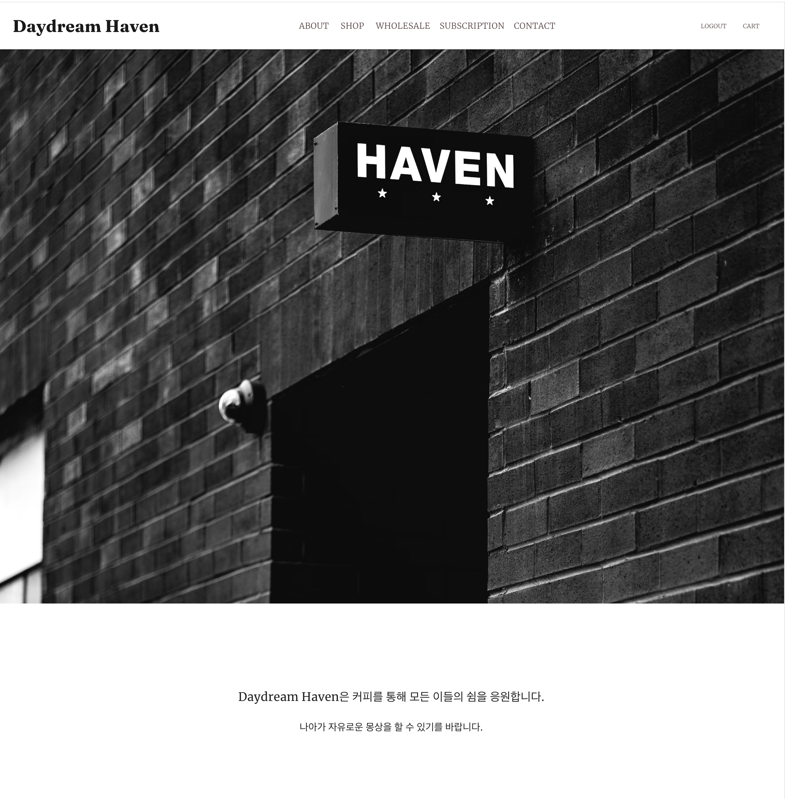

# Daydream Haven

> 커피브랜드 홈페이지 & 커피쇼핑몰 [Daydream Haven ☕️ ](https://daydream-haven.vercel.app/)

> 자세한 정보는 ['포트폴리오'로 이동 🥐](https://ukjae-portfolio.vercel.app/projects/daydreamHaven)

<br>

[](https://daydream-haven.vercel.app/)

<br>

## 🎙️ Description

Daydream Haven은 가상의 커피브랜드 홈페이지이면서 커피쇼핑몰입니다.
'평소 좋아하는 커피를 브랜드화해서 웹페이지로 직접 만든다면 어떨까?' 라는 생각으로 기획했습니다.<br><br>
프로젝트는 총 About, Shop, Wholesale, Subscription, Contact의 5가지 카테고리로 구성되어 있습니다. <br><br>
About은 해당 브랜드에 대한 설명이 있으며, Shop, Wholesale, Subscription은 판매하는 상품에 대한 페이지입니다. <br>(but, Wholesale은 간단히 구현되었습니다.)<br>
Contact은 실제 매장이 존재한다는 전제하에 매장에 대한 정보를 제공하는 페이지로 구현되었습니다.<br>
마이페이지에서는 사용자의 총 주문금액 및 횟수를 보여주며, 구매했던 주문 목록을 볼 수 있습니다. 주문 목록의 주문 상세정보를 클릭하면 상세한 주문 내역을 볼 수 있도록 구현되었습니다.<br>
Cart 페이지에서는 상품을 주문할 수 있으며, 주문페이지에서는 실제 결제를 하듯 결제를 진행할 수 있도록 가상결제 서비스를 구현하였습니다.<br>

<br>

## 💡 Main Feature

### 상품 정보 조회 및 선택 기능

-   각 카테고리에 맞는 판매상품 조회.
-   상품 상세정보 및 이미지 조회.
-   상품 옵션을 선택 후 상품 장바구니 담기 또는 바로 구매
-   다수 상품 선택 및 수량 조정.

### 사용자 주문 정보 조회 기능

-   총 주문 금액 및 횟수 조회.
-   주문 목록 전체 조회.
-   주문 목록별 상세 정보 조회.

### 장바구니 기능

-   원하는 상품 혹은 전체 상품을 주문.
-   특정 상품의 수량 변경.
-   특정 상품 혹은 전체 상품 삭제.
-   선택한 상품 총 금액에 따라 배송비 유무 확인.

### 가상 결제 서비스

-   포트원(Portone) 온라인 결제서비스를 통한 가상 결제 구현

<br>

## 🖥️ Getting Started

### Installation

```sh
git clone https://github.com/Gryffindor0ne/daydream-haven.git
npm install
```

### Develop Mode

```sh
npm run dev
```

<br>

## ⛵️ Stack

🖥️ Frontend : React, TypeScript, Redux, Redux-Saga, Redux-Persist, MUI <br><br>
🧺 Backend : Heroku <br><br>
🎉 Deployment : Vercel

<br>

## 🪜 Project Structure

```
├─ public
│  ├─ assets
│  │  └─ images
│  │     └─ daydream-haven.png
│  └─ favicon.ico
├─ src
│  ├─ App.tsx
│  ├─ api
│  │  ├─ checkAccessTokenValidityAPI.ts
│  │  ├─ getAllOrderAPI.ts
│  │  ├─ getLoginTokenAPI.ts
│  │  ├─ getOrderDetailsAPI.ts
│  │  ├─ getProductDetailAPI.ts
│  │  ├─ getProductsAPI.ts
│  │  ├─ getSubscriptionDetailAPI.ts
│  │  ├─ getSubscriptionsAPI.ts
│  │  └─ getUserDetailslAPI.ts
│  ├─ app
│  │  ├─ reduxHooks.ts
│  │  ├─ rootSaga.ts
│  │  └─ store.ts
│  ├─ components
│  │  ├─ cart
│  │  │  ├─ CartItem.tsx
│  │  │  └─ CartOrderSection.tsx
│  │  ├─ common
│  │  │  ├─ CapacityGrindSelector.tsx
│  │  │  ├─ LoadingIndicator.tsx
│  │  │  └─ QuantityButton.tsx
│  │  ├─ layout
│  │  │  ├─ Footer.tsx
│  │  │  ├─ Header.tsx
│  │  │  └─ popup
│  │  │     ├─ BasicPopup.tsx
│  │  │     ├─ CartGuidancePopup.tsx
│  │  │     └─ DuplicateGuidancePopup.tsx
│  │  ├─ location
│  │  │  ├─ AddressSeacrchForm.tsx
│  │  │  └─ Map.tsx
│  │  ├─ order
│  │  │  ├─ OrdererInfo.tsx
│  │  │  ├─ OrderItem.tsx
│  │  │  ├─ OrderItemList.tsx
│  │  │  └─ OrderList.tsx
│  │  └─ product
│  │     ├─ Product.tsx
│  │     ├─ ProductInfoBox.tsx
│  │     ├─ ProductSelectBox.tsx
│  │     ├─ ProductSummaryBox.tsx
│  │     ├─ ProductsList.tsx
│  │     └─ SubscriptionInfoBox.tsx
│  ├─ features
│  │  ├─ auth
│  │  │  ├─ authSaga.ts
│  │  │  └─ authSlice.ts
│  │  ├─ cart
│  │  │  └─ cartSlice.ts
│  │  ├─ order
│  │  │  └─ orderSlice.ts
│  │  └─ payment
│  │     ├─ paymentSaga.ts
│  │     └─ paymentSlice.ts
│  ├─ hooks
│  │  ├─ useScrollToTop.ts
│  │  ├─ usesFecthOrderInfo.ts
│  │  ├─ usesFecthSubscriptionInfo.ts
│  │  ├─ usesFecthProductInfo.ts
│  │  ├─ usesFecthUserInfo.ts
│  │  ├─ usesResponsiveLayout.ts
│  │  └─ useCurrentPathAndId.ts
│  ├─ index.css
│  ├─ lib
│  │  └─ axiosInstance
│  │     ├─ constants.ts
│  │     └─ index.ts
│  ├─ main.tsx
│  ├─ pages
│  │  ├─ About.tsx
│  │  ├─ Contact.tsx
│  │  ├─ Member.tsx
│  │  ├─ MyPage.tsx
│  │  ├─ OrderComplete.tsx
│  │  ├─ OrderDetail.tsx
│  │  ├─ OrderPayment.tsx
│  │  ├─ ProductDetail.tsx
│  │  ├─ Router.tsx
│  │  ├─ Shop.tsx
│  │  ├─ ShoppingCart.tsx
│  │  ├─ Subscription.tsx
│  │  ├─ Wholesale.tsx
│  │  ├─ auth
│  │  │  ├─ Login.tsx
│  │  │  └─ Register.tsx
│  │  ├─ index.tsx
│  │  └─ routes
│  │     ├─ AuthenticatedRoute.tsx
│  │     └─ UnauthenticatedRoute.tsx
│  ├─ theme
│  │  └─ index.tsx
│  ├─ types
│  │  ├─ cart.ts
│  │  ├─ order.ts
│  │  ├─ popup.ts
│  │  ├─ product.ts
│  │  └─ user.ts
│  ├─ utils
│  │  ├─ constants.ts
│  │  ├─ cookiesUtils.ts
│  │  ├─ date.ts
│  │  ├─ number.ts
│  │  ├─ orderTransform.ts
│  │  ├─ phone.ts
│  │  └─ product.ts
│  └─ vite-env.d.ts
├─ tsconfig.json
├─ tsconfig.node.json
├─ vercel.json
└─ vite.config.ts

```

<br>

<p align='center'>
     
    
     
   
</p>
